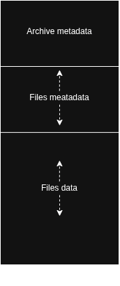

## CFAT architecture

### Archive Format

Every `.cfat` archive is a binary file with three contiguous sections:

1. **Archive Header** (`archive_header_t`) — 8 bytes
2. **File Headers** — one `files_header_t` per archived file
3. **File Data** — raw binary content of each file, in the same order as the headers




```
┌─────────────────────────────────────┐
│         Archive Header              │  archive_header_t
│  - magic_number (0x062AB188)        │
│  - version_number (1)               │
│  - file_count                       │
├─────────────────────────────────────┤
│         File Header 0               │  files_header_t
│  - filename[80]                     │
│  - file_size                        │
├─────────────────────────────────────┤
│         File Header 1               │  files_header_t
│  - filename[80]                     │
│  - file_size                        │
├─────────────────────────────────────┤
│              ...                    │
├─────────────────────────────────────┤
│         Raw Data: File 0            │  file_size[0] bytes
├─────────────────────────────────────┤
│         Raw Data: File 1            │  file_size[1] bytes
├─────────────────────────────────────┤
│              ...                    │
└─────────────────────────────────────┘
```

### Header Structures (`carchive.h`)

```c
typedef struct archive_header {
    const int magic_number;      // 0x062AB188
    unsigned int version_number; // 1
    unsigned int file_count;     // number of files in archive
} archive_header_t;

typedef struct files_header {
    char filename[80];           // null-terminated file name
    unsigned int file_size;      // size in bytes
} files_header_t;
```

### Module Layout

| Module | File(s) | Responsibility |
|--------|---------|----------------|
| **Core** | `cfat.c` | Program entry point |
| **Parser** | `cmdparser.c` | CLI flag dispatch (`-c`, `-i`, `-d`, etc.) |
| **Create** | `carchive.c` | Create new empty archive |
| **Insert** | `ifarchive.c` | Insert a file into an existing archive |
| **Delete** | `dfarchive.c` | Remove a file from an archive |
| **Replace** | `rarchive.c` | Replace a file inside an archive |
| **Extract** | `xarchive.c` | Extract a specific file |
| **List** | `larchive.c` | List archived files with sizes |
| **Count** | `narchive.c` | Print total file count |
| **Helper** | `helper.c` | Path/file-name parsing |
| **Design** | `design.c` | Coloured terminal I/O |

### Modification Mechanism

All modification commands (`-i` insert, `-d` delete, `-r` replace) follow the same pattern: **the entire archive is rebuilt into a temporary file, then the original is atomically replaced**.

1. Open the existing archive (`r+b`).
2. Create a new temporary file `arch.tmp` (`wb`).
3. Read the archive header from the original.
4. Read all file headers from the original.
5. Write the (possibly updated) archive header to `arch.tmp`.
6. Write the (possibly filtered/reordered) file headers to `arch.tmp`.
7. Copy file data from the original or from new input files to `arch.tmp`.
8. Close both files.
9. `remove()` the original archive file.
10. `rename("arch.tmp", archive_name)` to finalise the change.

This ensures the archive is always in a valid state (the old file is only deleted after the new one is fully written).


